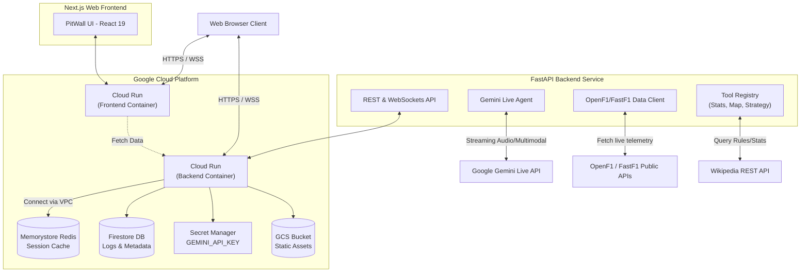

# PitWall-F1Engine 🏎️

**PitWall Live** is a real-time AI-powered Race Engineer dashboard tailored for Formula 1 strategy. Built for the Google Cloud Hackathon, it utilizes the **Gemini Live API** to provide an interactive, multimodal voice agent that understands live race data, predicts strategic outcomes, and can act as an educational F1 tutor natively integrated into the command center.

## Hackathon Project Description

### Project Vision and Live Agent Implementation
PitWall transforms the passive F1 fan experience into an interactive one. We built a Next-Generation AI Agent focused on **Real-time Interaction (Audio/Vision)**. 

Instead of just looking at spreadsheets of telemetry, users can talk natively to their "AI Race Engineer" through a voice interface that gracefully handles interruptions. The agent isn't just a chatbot; it is a **multimodal operator** that observes live data and executes complex strategic simulations while you speak.

### Core Features and Functionality
- **Multimodal Voice Agent**: Speak directly to the dashboard using your microphone. The agent leverages the **Gemini Live API** to have fluid, interruptible, low-latency conversations. It can "see" the race state and respond to your tone and urgency.
- **Real-time Track Map**: A live 2D SVG track map that plots driver positions using live `(x, y)` telemetry data. Watch the "pips" move synchronously with the timing screens.
- **Dynamic Toolkit**: The AI can execute tools on behalf of the user:
  - `project_pit_rejoin`: Calculates where a driver will land on track if they pit right now, accounting for traffic and the "pit window."
  - `estimate_undercut`: Evaluates the potential delta gain of pitting early to leapfrog a rival.
  - `recommend_strategy`: Our proprietary logic that analyzes tire age, intervals, and pace to recommend pitting or staying out.
  - `query_wikipedia`: Pulls F1 histories, definitions (like "What is DRS?"), and rules directly from Wikipedia as an educational tutor.
- **Context-Aware Sessions**: The Agent automatically detects the session type (Practice, Qualifying, or Race) to tailor its personality—from technical setup assistance to high-pressure race strategy.

### Development Roadmap
- **Predictive Tire Degradation**: ML models to forecast "the cliff" for each tire compound based on track temperature.
- **Multi-Driver Comparison**: Side-by-side telemetry overlays (Speed, Throttle, Brake) analyzed by the AI to spot where a driver is losing time.
- **Voice-Activated Pit Wall**: Direct integration to send strategy "orders" back to a simulated or real race management system.
- **Historical Playback Mode**: Re-live classic races with the AI Engineer providing "hindsight" strategy analysis.

### Technology Stack and Google Cloud Integration
- **Google Cloud Services Used**:
  - **Gemini Live API**: Powers the core multimodal, interruptible audio interaction. (via Google GenAI SDK).
  - **Cloud Run**: Fully serverless hosting for both the React Frontend and FastAPI Backend containers.
  - **Memorystore (Redis)**: High-speed caching for incoming live F1 telemetry.
  - **Firestore**: Serverless NoSQL document database for auditing AI tool usage and logging session state.
  - **Secret Manager**: Securely stores the `GEMINI_API_KEY`.
  - **Cloud Storage (GCS)**: Stores raw NDJSON telemetry replays.
- **Frontend**: Next.js (React 19), Tailwind CSS, ShadCN UI.
- **Backend**: Python, FastAPI.
- **Data Sources**:
  - **FastF1 / OpenF1**: Public APIs for acquiring official Formula 1 timing, telemetry, and track status data.
  - **Wikipedia API**: Text extracts for F1 historical context and rules.

### Technical Challenges and Insights
- **Tool Bindings with Live Audio**: Binding JSON schemas to an audio-first agent requires aggressive prompting to ensure the model doesn't "read out" raw tool JSON (like long timestamps or messy coordinates) but instead parses it conversationally.
- **Handling High-Frequency Telemetry**: F1 telemetry comes in fast. Using a dedicated Redis instance was critical; otherwise, the Python backend couldn't process the math for undercut projections quickly enough while simultaneously maintaining the WebRTC/WebSocket audio stream with Gemini.

---

## System Architecture Diagram

Below is the high-level architecture showing how the Frontend, Backend, Google Cloud services, and the Gemini Live API interact natively.
*(For a raw file view, see `architecture.md`)*



---

## Cloud Deployment Guide (Terraform)

The project includes a fully robust Infrastructure-as-Code (IaC) setup using **Terraform** to deploy to Google Cloud.

Requirements: `gcloud` CLI installed, authenticated, and Docker installed.

### 1. Prerequisite Checklist
Before deploying, ensure you have:
1.  **GCP Account**: A Google Cloud project with billing enabled.
2.  **Gemini API Key**: Obtain one from [Google AI Studio](https://aistudio.google.com/).
3.  **Local Tools**: `gcloud` CLI, `terraform`, and `docker` installed.

### 2. Build and Push Application Images
We use **Google Cloud Build** to remotely package the application into **Artifact Registry**. This ensures the containers are optimized for Cloud Run.

```bash
# Set your variables
PROJECT_ID="your-project-id"
REGION="us-central1"

# 1. Create the Docker Repository
gcloud artifacts repositories create pitwall-repo \
    --repository-format=docker \
    --location=$REGION \
    --description="Docker repository for PitWall"

# 2. Build Backend
cd backend
gcloud builds submit --tag $REGION-docker.pkg.dev/$PROJECT_ID/pitwall-repo/pitwall-backend:latest

# 3. Build Frontend
cd ../web
gcloud builds submit --tag $REGION-docker.pkg.dev/$PROJECT_ID/pitwall-repo/pitwall-web:latest
```

### 3. Deploy the Infrastructure (IaC)
Navigate to the `infra` directory. Terraform will stand up the entire managed stack, including VPC connectors and security policies.

```bash
cd ../infra
cp terraform.tfvars.example terraform.tfvars
```

Update your `terraform.tfvars`:
```hcl
project_id     = "your-project-id"
region         = "us-central1"
gemini_api_key = "AIza..." # Your Key
backend_image  = "us-central1-docker.pkg.dev/your-project/pitwall-repo/pitwall-backend:latest"
web_image      = "us-central1-docker.pkg.dev/your-project/pitwall-repo/pitwall-web:latest"
```

Run Terraform:
```bash
terraform init
terraform apply -auto-approve
```

**Success!** Terraform will output your `web_url`. Open it to launch the command center.


---

## Local Development and Testing

If you'd prefer to test locally without deploying to GCP, refer to the local scripts:
For detailed local configuration, see the [LOCAL_SETUP.md](./LOCAL_SETUP.md) documentation.

```bash
# Requires Docker running for local Redis
./run_local.bat
```